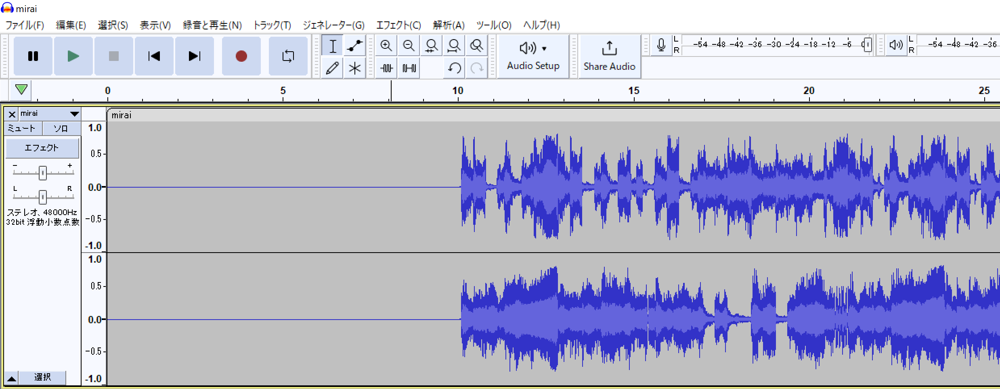
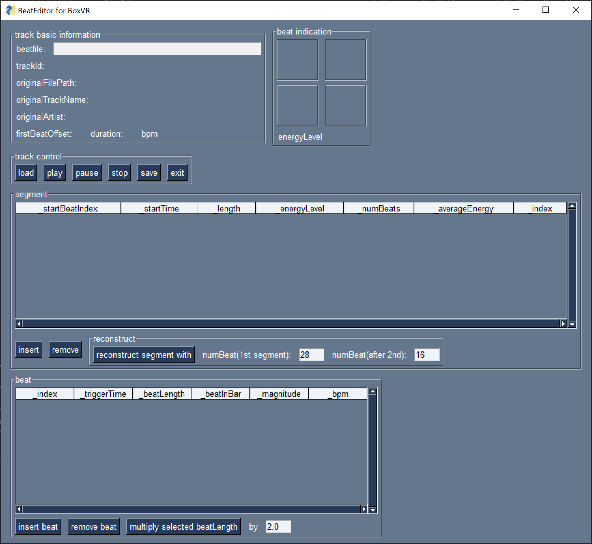
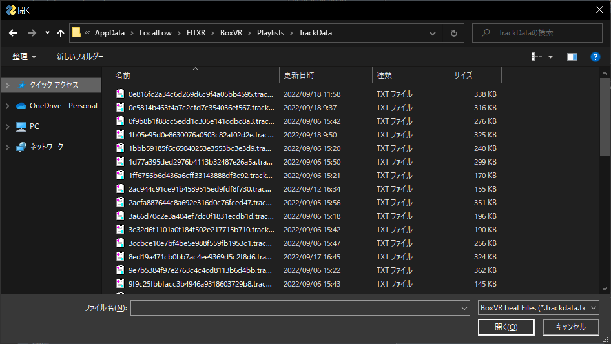
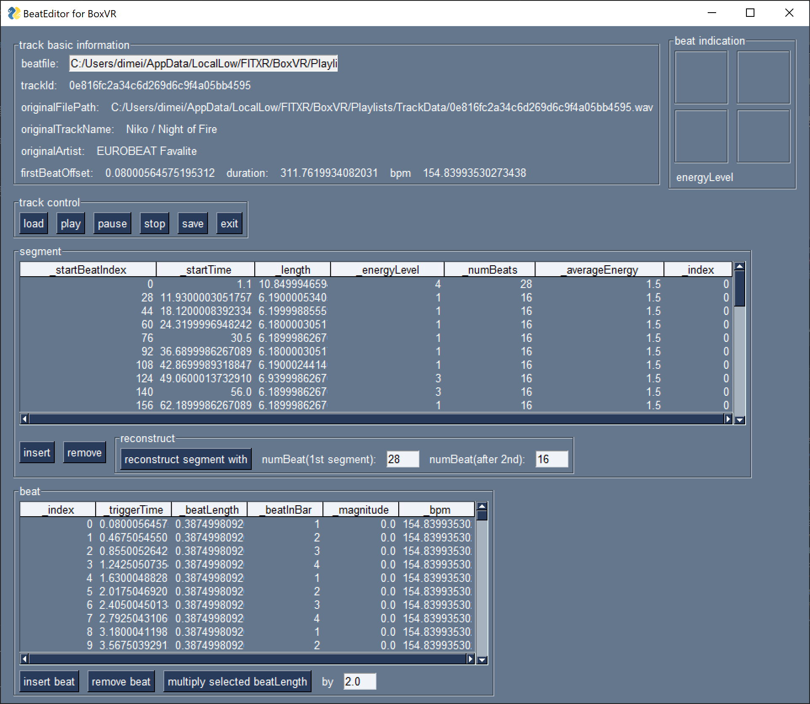
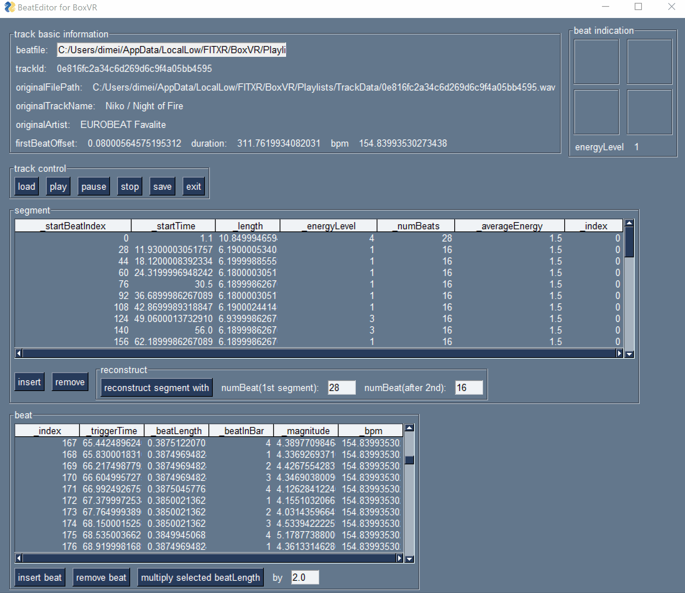
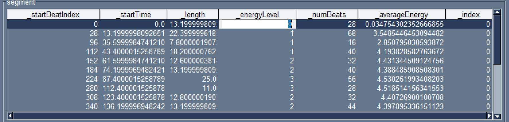

# BeatEditor for BoxVR manual

I don't grasp a mechanism of BoxVR completely and this program is under construction.

Therefore following procedure is unstable and will probably be updated.

## Tutorial tour(main procedure)

Before following This tutorial, I **strongly recommended** to backup your original beat data if you have already created it.

BoxVR(Steam) beat data is usually located:

```
C:\Users\(user name)\AppData\LocalLow\FITXR\BoxVR\Playlists\TrackData
```

Replace (user name) with your windows user name.

### 0. Prepare specific music data and import into BoxVR.

First of all, I recommend preparing special music data to import BoxVR. And the music data should insert a mute area into the beginning of the music.

We can set a timing that spawn a object for action(punch, duck, etc...).

However even if BoxVR spawns a target in the time we specified, we can't always hit(duck) a object in the timing we intended(synchronized with the music). 

There is a gap between '_triggerTime' and the timing we hit(duck) a object. I call this gap 'delay'.

In my experience of observing BoxVR behaviour, I guess this gap is 8 beats worth of time.

And in BoxVR, we can only control the timing of changing beat patterns with some regulation. We can only set a beat pattern separately with 16 beats worth of time.

Therefore, we need to prepare a music that mute part of the beginning of the music is over 16 beats including delay time.

So I usually insert into 10 second mute part to beginning of the music(includes enough margin).



You can do this operation with [Audacity](https://www.audacityteam.org/).

And as usual, import the music into BoxVR.

### 1. Launch BeatEditor

* If you run BeatEditor successfully, You will see this window.



### 2. Load track data

* Press a 'load' button in the track control. You will see the file open dialog.



* After selecting a beat data you want to edit, this tool will load it and update the view as follows.



### 3. Play track data

* In this situation, if you press a 'play' button, this tool will play the music of this track with a beat sound effect according to the beat file.



* You can stop to press the 'pause' or 'stop' button. 
	* 'pause' button keeps the current position of the music.

* And If click a specific row of a segment table before pressing the 'play' button, BeatEditor will play from near this segment. 

* This function is a simplified simulator of BoxVR during beat editing. You can check the result of editing the beat file.

### 4. Edit beat file

Edit beat files. 

I recommend that you follow these steps.

#### 4.1 Restructure seguments.

Now, You can see a some 'segment' of this beat file on BeatEditor. These are separated by BoxVR automatically.

However, as mentioned above, BoxVR can only control beat pattern every 16 beats. So I recommend restructuring segments with 16beats.

When press 'restruct with 16 beats' button, BeatEditor restruct 'segment' of all with 16 beats.

#### 4.2 Adjust the timing of the first beat.

Next, you need adjust the timing of the first beat.

If you press 'move next triggetTime' button, you can forward a timing of the first beat with a length of one beat, and press 'back with own beatLength' button, you can backword it.

#### 4.3 Set '_energyLevel' of each segments.

'_energyLevel' specifies a beat pattern of each segment.

|#|event|
|:-|:-|
|4(or other than the following value)|This segment doesn't occur any event in all 16 beats |
|3|This segment guarantees to occur any event(including ducks, squats, etc..) in all 16 beats|
|2|This segment guarantees to occur punching event in all 16 beats|
|1|This segment occurs at any event in half of 16 beats|
|0|same as 1|

If you click a cell of '_energyLevel' in the segment table, you can edit this cell, refer above table and input '_energyLevel' you preffered to all segments.



The result of these settings can be checked while listening by [pressing 'play'](#3-play-track-data).

#### 4.4 Operations I do all the time

With now version(1.0.2) I usual do:

1. '_energyLevel' of 1st and 2nd segment are set 4 to supress the beat in muted part of the beginning of the music.
	* It may not need for 2nd segment.
2. I adjust the timing of the first beat with forwarding 4 to 8 beats.
	* Sometimes it's better to backword.

In my experience, this operation will roughly synchronize the beateditor simulator and BoxVR.

### 5. Save Beat file

* If you finish editing beat data, save your result. Press a 'save' button.


* After inputting a file name(I recommend the same file for original beat data), press 'store'.
	* If you prepared backup beat data, you can update the original file directly.

### 6. Test your beat file.

* If you replace the original beat data with the results of your edit, play BoxVR to test it.

It may be necessary to repeat this procedure(1 to 6).
