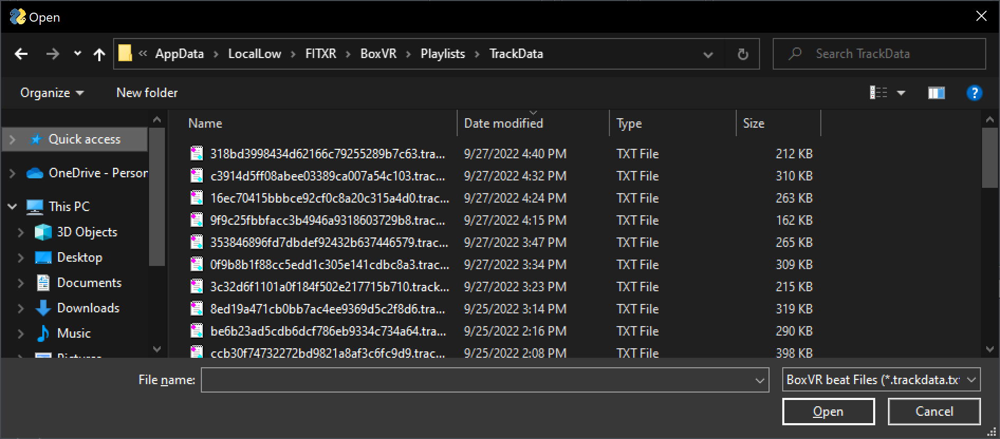
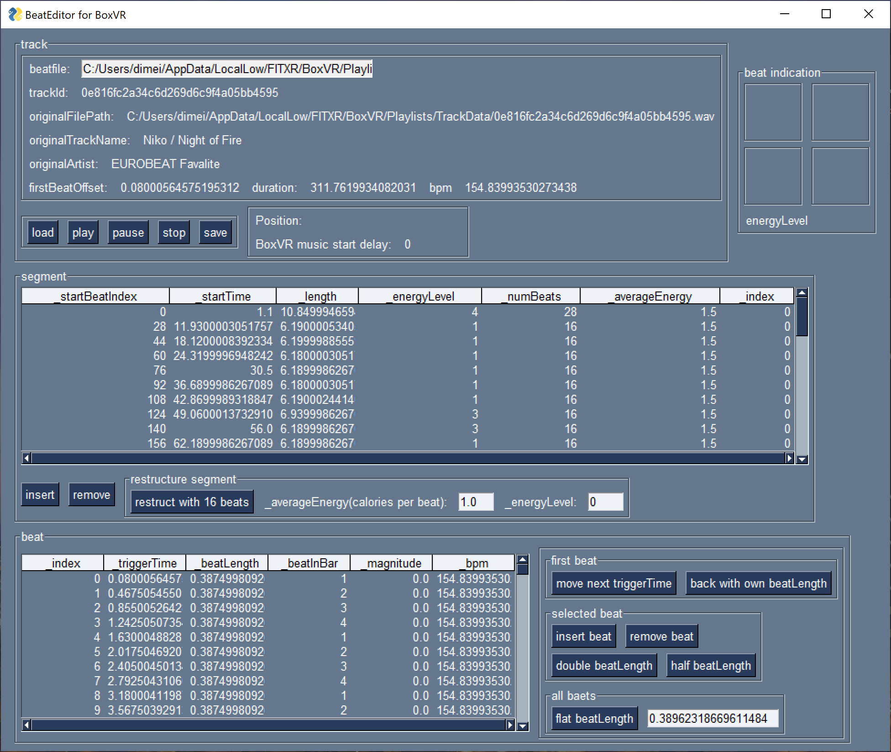
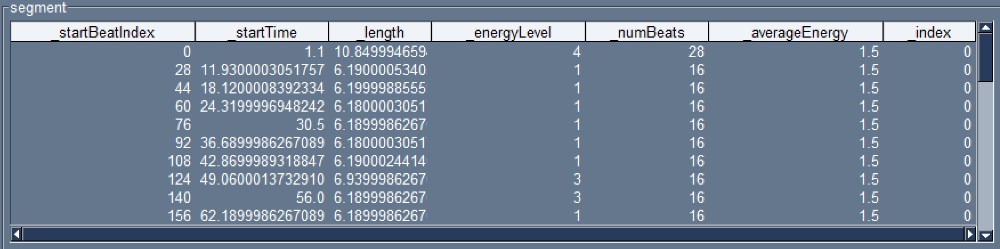

# BeatEditor for BoxVR manual

## Tutorial tour(main procedure)

### 0. Backup your original beat data.

Before following This tutorial, I **strongly recommended** to backup your original beat data.

BoxVR(Steam) beat data is usually located:

```
C:\Users\(user name)\AppData\LocalLow\FITXR\BoxVR\Playlists\TrackData
```

Replace (user name) to your windows user name.

### 1. Launch BeatEditor

* If you run BeatEditor successfully, You will see this window.


### 2. Load track data

* Press 'load' button in track control. You will see file open dialog.



* After select beat data you want to edit, this tool will load it and update view as following.



### 3. Play track data

* In this situation, if you press 'play' button, this tool will play music of this track with beat sound effect according to the beat file.


* You can stop to press 'pause' or 'stop' button. 
	* 'pause' button keeps current position of music.

* And If click specific row of segment table before press 'play' button, BeatEditor will play from near this segment. 

* These functions are simplified simulater of BoxVR during beat editing. You can check a result of editing beat file.

### 4. Edit beat file

* Edit beat files. 

* However, it is need some techniques and some knowledges of BoxVR beat control to edit beat file as you likes. I will explain these skill and knowledge [later](#techniques-and-knowledge-for-effective-editing-of-boxvr-beat-data).

### 5. Save Beat file

* If you finish to edit beat data, save your result. Press 'save' button.


* After input file name(I recommend same file to original beat data), press 'store'.
	* If you prepared backup beat data, you can update original file directly.

### 6. Test your beat file.

* If you replace original beat data to results of you edit, play BoxVR for test it.

You may be necessary to repeat this procedure(1 to 6).

## techniques and knowledge for effective editing of BoxVR beat data

Result a little analysis a mechanism in BoxVR to control beat with a beat data json, I found a some principle(and better practice) for editing beat file.

### 1. a relationship energyLevel and segment

#### 1. Separate each segment with 16 beats and set '_energyLevel' by segment.

[As shared in reddit](https://www.reddit.com/r/vrfit/comments/j69trv/improving_boxvr_custom_songs_windows_technical/), We can edit '_energyLevel' to change beat pattern(punch/duck,etc...).

But I can't change each 1 beat pattern individually.

During I tried several songs in hard mode, I found:

* The beat pattern can be changed every 16 beats. 
* setting of '_energyLevel' is effective in the range of each segment.

So, '_energyLevel' actual means:

|#|event|
|:-|:-|
|4(or other than follwing value)|This segment don't occur any event in all 16 beats(NOTE) |
|3|This segment guarantees to occur any event(include ducks, squats, etc..) in all 16 beats|
|2|This segment guarantees to occur any punching event in all 16 beats|
|1|This segment occurs any event in half of 16 beats|
|0|same as 1|

(NOTE) Setting 4 in '_energyLevel' in middle of music may be occur uncontroll timing.

If you control beat timing as you like, I recommend separeate each segment with 16 beats. And set '_energyLevel by segment.

#### 2. To adjust music start timing, insert several seconds of mute part in beginning of music before processing by BoxVR.

If you do so, BoxVR is more likely to separates segments with first muted part between music part.

And as these segment separating allow that we edit adjust match music start timing and beat easily.

### Example of better segment editing

We can edit beat data as our like by above better practices.

So, I show an example.

#### 1. Make an original beatdata.

* According above practice 2, I inserted 10 seconds of mute part of this music.


* 1st segment(_startBeatIndex:0, startTime:0.0 ...) relates mute part.
* **numBeat of this segment is 28.**

#### 2. Reconstruct segments

* Respect 1st segment separation by BoxVR, Reconstruct segment with:
	* set numBeat of 1st segment is same condition of original.
	* and set numBeat of after segment 1 is 16.

* In this example, set **'numBeat(1st segment)' is 28,** and set 'numBeat(after 2nd)' is 16. and press 'reconstruct segment with'.

* BeatEditor automatically adjust segments following.


#### 3. set energyLevel of each segments.

* set _energyLevel of each segments.
	* You can edit _energyLevel to click cell in segment table.


* Because 1st segment relates mute part, I recommend set energyLevel of 1st segment 4(no event).

* and set _energyLevel of after 2nd segment as you like.



#### 4. check a result of segment setting.

* If you finished setting energyLevel, let's check result, [play music in BeatEditor.](#3-play-track-data)

### 2. Adjust beatLength for irregular time signature

T.B.D.

