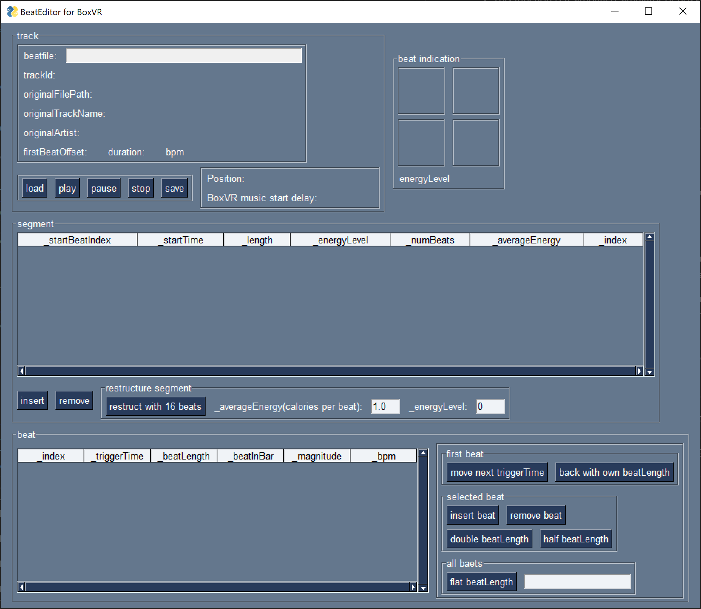

# BeatEditor for BoxVR manual

## Tutorial tour(main procedure)

### 0. Back up your original beat data.

Before following This tutorial, I **strongly recommended** to backup your original beat data.

BoxVR(Steam) beat data is usually located:

```
C:\Users\(user name)\AppData\LocalLow\FITXR\BoxVR\Playlists\TrackData
```

Replace (user name) with your windows user name.

### 1. Launch BeatEditor

* If you run BeatEditor successfully, You will see this window.



### 2. Load track data

* Press a 'load' button in the track control. You will see the file open dialog.


* After selecting a beat data you want to edit, this tool will load it and update the view as follows.


### 3. Play track data

* In this situation, if you press a 'play' button, this tool will play the music of this track with a beat sound effect according to the beat file.


* You can stop to press the 'pause' or 'stop' button. 
	* 'pause' button keeps the current position of the music.

* And If click a specific row of a segment table before pressing the 'play' button, BeatEditor will play from near this segment. 

* This function is a simplified simulator of BoxVR during beat editing. You can check the result of editing the beat file.

### 4. Edit beat file

* Edit beat files. 

* However, it needs some techniques and some knowledge of BoxVR beat control to edit the beat file as you like. I will explain these skills and knowledge [later](#techniques-and-knowledge-for-effective-editing-of-boxvr-beat-data).

### 5. Save Beat file

* If you finish editing beat data, save your result. Press a 'save' button.


* After inputting a file name(I recommend the same file for original beat data), press 'store'.
	* If you prepared backup beat data, you can update the original file directly.

### 6. Test your beat file.

* If you replace the original beat data with the results of your edit, play BoxVR to test it.

It may be necessary to repeat this procedure(1 to 6).

## techniques and knowledge for effective editing of BoxVR beat data

Result of a little analysis of a mechanism in BoxVR to control beat with a beat data JSON, I found some principles(and better practice) for editing beat files.

### 1. a relationship '_energyLevel' and segment

#### 1. Separate each segment with 16 beats and set '_energyLevel' by segment.

[As shared in reddit](https://www.reddit.com/r/vrfit/comments/j69trv/improving_boxvr_custom_songs_windows_technical/), We can edit '_energyLevel' to change beat pattern(punch/duck,etc...).

But I can't change each 1 beat pattern individually.

During I tried several songs in hard mode, I found:

* The beat pattern can be changed every 16 beats. 
* setting of '_energyLevel' is effective in the range of each segment.

So, '_energyLevel' actual means:

|#|event|
|:-|:-|
|4(or other than the following value)|This segment doesn't occur any event in all 16 beats(NOTE) |
|3|This segment guarantees to occur any event(including ducks, squats, etc..) in all 16 beats|
|2|This segment guarantees to occur any punching event in all 16 beats|
|1|This segment occurs at any event in half of 16 beats|
|0|same as 1|

(NOTE) Setting 4 in '_energyLevel' in the middle of music may occur uncontrolled timing.

If you control beat timing as you like, I recommend separateing each segment with 16 beats. And set '_energyLevel by segment.

#### 2. To adjust music start timing, insert several seconds of mute part at the beginning of music before processing by BoxVR.

If you do so, BoxVR is more likely to separate segments with the first muted part between the music part.

And as this segment separates allows that we edit adjust match music start timing and beat easily.

### Example of better segment editing

We can edit beat data as our like by above better practices.

So, I show an example.

#### 1. Make an original beat data.

* According to above practice 2, I inserted 10 seconds of mute part of this music.


* 1st segment(_startBeatIndex:0, startTime:0.0 ...) relates mute part.
* **'_numBeat' of this segment is 28.**

#### 2. Reconstruct segments

* Respect 1st segment separation by BoxVR, Reconstruct segment with:
	* set '_numBeat' of the 1st segment in the same condition as the original.
	* and set '_numBeat' of after segment 1 as 16.

* In this example, set **'numBeat(1st segment)' is 28,** and set 'numBeat(after 2nd)' is 16. and press 'reconstruct segment with'.

* BeatEditor automatically adjusts segments following.


#### 3. set '_energyLevel' of each segments.

* set _energyLevel of each segment.
	* You can edit _energyLevel to click a cell in the segment table.


* Because 1st segment relates mute part, I recommend setting '_energyLevel' of 1st segment 4(no event).

* and set _energyLevel of after the 2nd segment as you like.


#### 4. check the result of the segment setting.

* If you finished setting '_energyLevel', let's check result, [play music in BeatEditor.](#3-play-track-data)

### 2. Adjust beatLength for irregular time signature

T.B.D.

